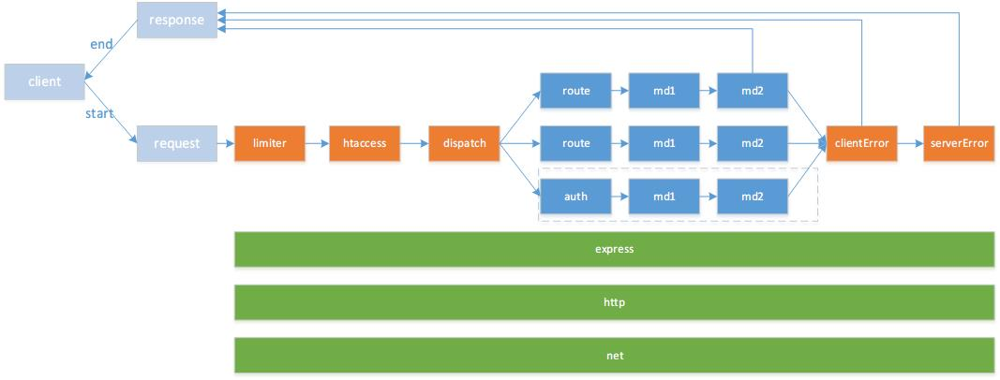

# express 最佳实践

最近，一直在使用 nodejs 做项目，对 nodejs 开发可以说深有体会。

先说说 nodejs 在业务中的脚色，, 在 `web同构` 方面， nodejs 的优势相对于其他语言来说，可以说非常巨大，基本上算是只有 nodejs 能做，其他语言根本不能做。在`传统 web 开发`方面，nodejs（必竟时间太短了）的相对于其他语言来说的劣势，已经不是太明显了。

再来说说自己，算了算差不多做了 5 个项目，都是使用 express 做为项目的基础框架，然后再上面进行业务开发工作，一个路由下来，平均 10 个左右的中间件，执行效率都是不错的，开发效率也非常好，是时候总结一下 express 实践经验，同时结合配套自己的想法，来看看理想中 express 项目应该是怎样的规划，以及我是怎么想的。

## 思想
做一个项目的规划，首先要为项目订一个基调，就是项目架构是应该怎样设计，怎样考虑的，对业务开发是否方便，部署是否方便等要素。

我现在认为一个项目最重要的规划是：`核心+插件式开发`。一个项目一定要支持这两点，如果不支持这个项目就很难做下去，为什么我这样说。因为现在的任何一个项目都不可能是一个人开发，一定是多人分工开发，如果你的项目支持 `核心+插件式开发`，你就可以把核心的基础功能如：网络，日志，基础布局等功能，找个高级工程师来完成；业务开发，就可以分给一些初级工程师，并行完成，同时在做项目的时候对代码码进行审查，及时调整坏代码。这样项目，能保证进度，也能保证项目质量，不会大烂，同时人力也得到了充分利用。

这种思想落实到架构上，就是从项目的文件组织结构上考虑怎样达到这样的目标。

我是这样规划文件目录的：

### 按业务特性而不按分层进行规划
分层最典型的代表就是`ruby on rails`，app 目录下，就是 controllers, models等目录，当然我不是说，这种规划不好，只是到项目大到一定程度，你想找某个 controller 下的一个方法，就会很麻烦，不知道没有这种体验，在几十个文件中找某个方法是怎样的感觉，搜索也是全文搜索，不能限定到某个目录下面。因此在这个项目规划中，以业务特征为插件名，在 express 中，也就是 subExpress，如果，我有一个购物车的业务，那于购物车相关的所有的项目都规在 `passport` 这个子应用下了，这样相关的业务在一起，方便查找，同时也方便理解和修改。当然这种规划方式也有不方便的地方，如果想跨 subApplication 调用方法，就没有那么方便。

### 边界显式说明
这个跟传统的 controller, service , model 没有什么区别。还是刚才的 passport 应用，按分层进行划分，包括 controllers, services, models, views, index.js, router.js。需要说明一下，在项目中我们一再强调， controllers 中负责与 http 的连接工作，只做简单参数的验证，传参和调起 services ，禁止把 rep, res 对像做为参数传递到 services 层；services 层纯业务，没有与 http 相关的任何东西，需要数据请调用 models 中的方法；models 只于数据打交到，其它都不管。这样做的好处是什么呢？ 想想看，如果相把一个页面的数据拿出来做接口，只需要简单几行就搞定了，还有如果要把框架改成 koa ，你的业务都不用重写，还有你想增加 websocket 的支持，直接在 controllers 进行调整就行了。 models的作用更明显，原来的项目是一个普通是 web 项目，models 是连接数据库的，现在技术升级要前后端分离，不用数据库了，改成调用后端的接口了，你就只用把　models 用接口实现一遍，其他不用变了。 controllers 和 models 就是你业务的边界，service 则是你业务的核心，边界实现的改变不应该影响你业务。

### 落实
思想利用 express 的中间件思想，达到我的架构意图，如下图所示：

